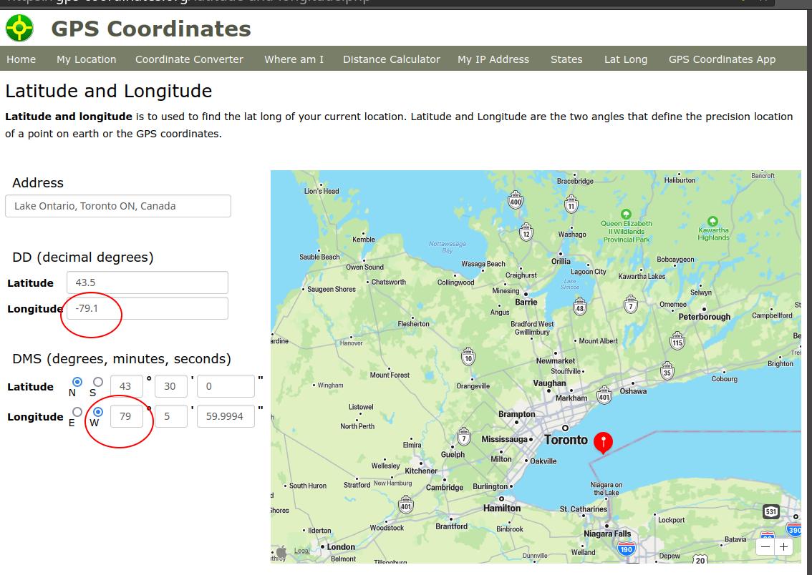
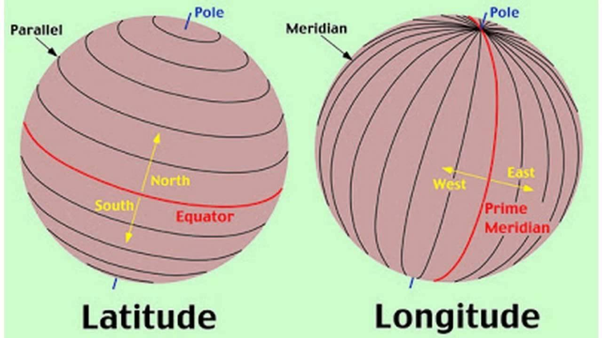
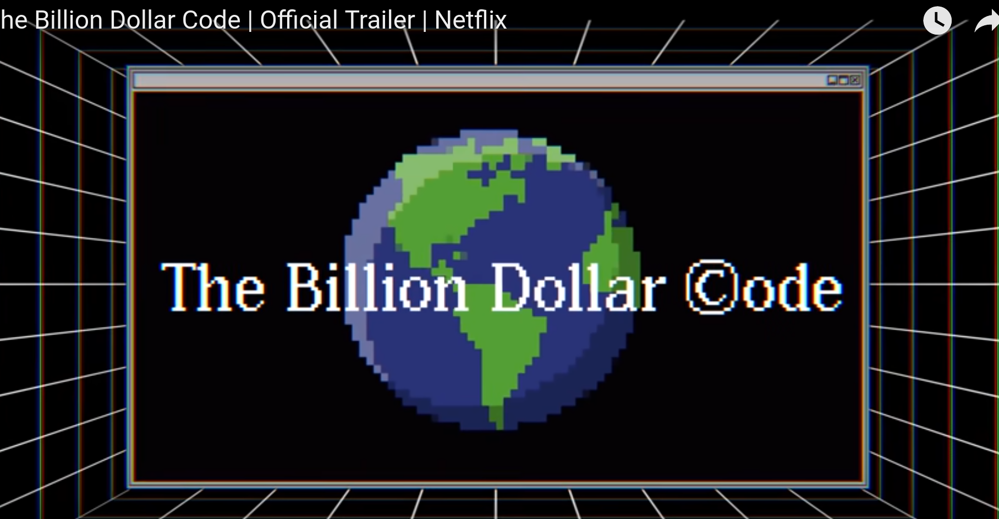

# Quiz 3 - Message in a Bottle

What are we doing?
- we will use `GPS lat-long` coordinates to send each other messages
- this will be done through `location based AR`
- you will test locally using a `local sever` aka `localhost` or `127.0.0.1`

---

## What is Latitude and Longitude?



### Latitude

- `North` and `South` from the `Equator`
- `-90` to `90`

The latitude is the angular distance of a place north or south of the earth's equator. The degree of the angle is between -90° and 90°. It is usually expressed in degrees and minutes.
>
> -79 = 79W
>

### Longitude

- `East` and `West` from the `Prime Meridian`
- `0` to `180`

The longitude is the angular distance of a place east or west of the meridian at Greenwich, England, or west of the standard meridian of a celestial object. It is usually expressed in degrees and minutes. 
>
> 43 = 43N
>



---

## Transforming Between Coordinate Spaces

Might want to think about how you see an object, how the object sees itself, and how the object sees the world...

Just in case you want to think about how items and objects might be oriented in 3D space, or if your item is rotating or displaying in positions you aren't intending!

Every object and the scene (world) in general has their own coordinate space. A parent object’s position, rotation, and scale transformations are applied to its children’s position, rotation, and scale transformations. Consider this scene:


```HTML
<a-entity id="foo" position="1 2 3">
  <a-entity id="bar" position="2 3 4"></a-entity>
</a-entity>

```

From the world’s reference point, foo has position (1,2,3) and bar has position (3, 5, 7) since foo’s transformations apply onto bar’s. From foo’s reference point, foo has position (0, 0, 0) and bar has position (2, 3, 4). Often we will want to transform between these reference points and coordinate spaces.

---------------- foo <) ----->  bar

--------------- (0,0,0) -----> (2,3,4)


world <)-------> foo <) -----> bar

(0,0,0) ------> (1,2,3)

world <)--------------------> (3,5,7)

---

## Spherical Mercator

Fancy way to say this mapping coordinate system preserves shapes and angles (Because, yep, the world is a `sphere`...but now we are making it `flat`!)

The following link is a `Map API`, scroll down on the landing page to learn a bit more about resolution, scales, and the transition from 
`Degrees` -> `Meters` -> `Pixels` -> `Tiles`.

Check me out, zoom and move around!
[sphere to tiles by zoom](https://www.maptiler.com/google-maps-coordinates-tile-bounds-projection/#12/-79.55/43.74)


RELATED:

(actually if you decide you have time check out `The Billion Dolar Code`, the [mostly true story](https://www.sfgate.com/streaming/article/netflix-drama-google-lawsuit-billion-dollar-code-16533314.php) of some `DIGITAL MEDIA / TECHNICAL ARTISTS / CREATIVE HACKERS` that sued `Google` regarding _who really created google earth_)

Their startup was called `ART+COM`.. shh it's a link to the trailer:
[](https://youtu.be/iDvPvqImb-4 "ART+COM")

---


## `A-Frame` Components List

This is just a list of possible components that are easily accessible. Each component has a corresponding `.js` file that handles the _backend_. We can use these components, and in fact we have in just about all the `AR` files found in the `GroupProject_info` repo.

[Link to Components list](https://github.com/aframevr/aframe/tree/master/src/components). Note that we don't need to open these files and change anything inside, we can just use them like:

``` HTML
<a-entity gltf-model="" rotation=""></a-entity>
```

Specifically, we have used:
- rotation
- position
- scale
- gltf-model
- obj-model
- camera
- animation

Maybe you want to think about other options like:
- sound
- text
- visible
- hide-on-enter-ar
- shadow

### Core Components

The following `core components` we _for sure_ use:

- a-assets
- a-entity

### Some other Geometries

We have used `box`, `sphere`, `cylinder`, `plane`... there are also:

- circle
- cone
- ring
- torus
- triangle

... and others!


